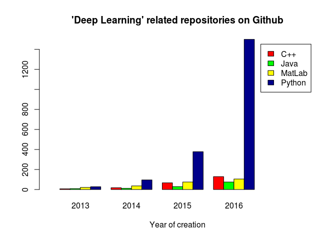

-   [Executive Conjecture](#executive-conjecture)
-   [Introduction](#introduction)
-   [Keyword \#1: "Analysis"](#keyword-1-analysis)
-   [Keyword \#2: "Spark"](#keyword-2-spark)
-   [Keyword \#3: "Machine Learning"](#keyword-3-machine-learning)
-   [Keyword \#4: "Deep Learning"](#keyword-4-deep-learning)
-   [+1: "Big Data"](#big-data)
-   [Conclusion](#conclusion)

Executive Conjecture
--------------------

Python.

Introduction
------------

Which language to choose for analytics? It can be hard to tell.

The competition of programming langauges is already a long story and
continues to stretch on. Judging the topic is difficult, subjective and
is prone to statistical methodological issues.

This analysis is aimed at getting some indication of the trends, but by
no means to come up with a definitive result or judgement over any
debate.

The present version attempts to achieve even less - to be a starting
point for the above. I had to do some manual scraping to get some
results quickly, hopefully no error has been made, a more streamlined
approach is to follow later.

The "methodology" was quite simple, I searched GitHub with keywords like
Analysis and Spark on a yearly basis (as much as possible), and took a
note of the results in csv's.

Keyword \#1: "Analysis"
-----------------------

The most interesting here is probably that the influence of R seems to
plateau out.

<table>
<thead>
<tr class="header">
<th></th>
<th align="right">2013</th>
<th align="right">2014</th>
<th align="right">2015</th>
<th align="right">2016</th>
</tr>
</thead>
<tbody>
<tr class="odd">
<td>R</td>
<td align="right">556</td>
<td align="right">3833</td>
<td align="right">5264</td>
<td align="right">5247</td>
</tr>
<tr class="even">
<td>Python</td>
<td align="right">1418</td>
<td align="right">2547</td>
<td align="right">4388</td>
<td align="right">6136</td>
</tr>
<tr class="odd">
<td>Java</td>
<td align="right">614</td>
<td align="right">1045</td>
<td align="right">1775</td>
<td align="right">2256</td>
</tr>
</tbody>
</table>

For some, the likely surprise of the (currently fractional) year 2016
may also be that Python (at least in this aspect) seems to be overtaking
the lead in being the prime vehicle for analytics from R. Beyond that,
both are strong candidates and Python is obviously involved in more
analysis related libraries than R (part of the perceived growth is that
it is probably catching up), which is just one of the reasons to scratch
our heads whether to accept such finding as a fact. However, probably
not many are that surprised, and this is just what it is. The R
ecosystem needs to pull itself together quick if it wants to achieve
more than to see the Python train passing.

(Note that GitHub is a distorted representation - a large proportion of
the repositories is simple coursework... but also mind that coursework
is a good predictor of future preference.)

Keyword \#2: "Spark"
--------------------

<table>
<thead>
<tr class="header">
<th></th>
<th align="right">2013</th>
<th align="right">2014</th>
<th align="right">2015</th>
<th align="right">2016</th>
</tr>
</thead>
<tbody>
<tr class="odd">
<td>Python</td>
<td align="right">33</td>
<td align="right">148</td>
<td align="right">668</td>
<td align="right">1088</td>
</tr>
<tr class="even">
<td>Java</td>
<td align="right">85</td>
<td align="right">375</td>
<td align="right">1133</td>
<td align="right">2166</td>
</tr>
<tr class="odd">
<td>Scala</td>
<td align="right">67</td>
<td align="right">553</td>
<td align="right">1702</td>
<td align="right">2906</td>
</tr>
</tbody>
</table>

Scala steadily seems to be the major player at Spark. SparkR is in a
pre-explosion state, if anywhere - and R didn't make it to the top 10 in
any year.

However, looking at ItJobsWatch provides a slightly different result at
the time writing, at least in the London context: Java and Apache Spark
are more often colocated in job advertisements than Scala and Apache
Spark. But! Java is big (30%) otherwise, some Spark users and thus teams
will have a Hadoop background with a carried over Java preference, and
not sure how much of its slight dominance would be left once we
corrected for that.

See <http://www.itjobswatch.co.uk/jobs/london/apache%20spark.do> for the
current status in case of interest.

Similarly GitHub for the past 6 months indicates a trendshift, too -
however due to potential seasonality issues and overwhelming Christmas
laziness that's not been presented here. Next version.

Keyword \#3: "Machine Learning"
-------------------------------

<table>
<thead>
<tr class="header">
<th></th>
<th align="right">2013</th>
<th align="right">2014</th>
<th align="right">2015</th>
<th align="right">2016</th>
</tr>
</thead>
<tbody>
<tr class="odd">
<td>Python</td>
<td align="right">436</td>
<td align="right">956</td>
<td align="right">2114</td>
<td align="right">4924</td>
</tr>
<tr class="even">
<td>Java</td>
<td align="right">155</td>
<td align="right">313</td>
<td align="right">529</td>
<td align="right">685</td>
</tr>
<tr class="odd">
<td>R</td>
<td align="right">49</td>
<td align="right">556</td>
<td align="right">511</td>
<td align="right">691</td>
</tr>
</tbody>
</table>

I think this one needs no explanation. In my experience, GitHub repos
are quite often related to online learning, and the conclusion to draw
is that Python is the de facto standard of choice for teaching machine
learning.

Keyword \#4: "Deep Learning"
----------------------------

<table>
<thead>
<tr class="header">
<th></th>
<th align="right">2013</th>
<th align="right">2014</th>
<th align="right">2015</th>
<th align="right">2016</th>
</tr>
</thead>
<tbody>
<tr class="odd">
<td>C++</td>
<td align="right">7</td>
<td align="right">18</td>
<td align="right">67</td>
<td align="right">129</td>
</tr>
<tr class="even">
<td>Java</td>
<td align="right">9</td>
<td align="right">12</td>
<td align="right">29</td>
<td align="right">75</td>
</tr>
<tr class="odd">
<td>MatLab</td>
<td align="right">21</td>
<td align="right">36</td>
<td align="right">75</td>
<td align="right">105</td>
</tr>
<tr class="even">
<td>Python</td>
<td align="right">28</td>
<td align="right">96</td>
<td align="right">378</td>
<td align="right">1500</td>
</tr>
</tbody>
</table>

+1: "Big Data"
--------------

<table>
<thead>
<tr class="header">
<th></th>
<th align="right">2013</th>
<th align="right">2014</th>
<th align="right">2015</th>
<th align="right">2016</th>
</tr>
</thead>
<tbody>
<tr class="odd">
<td>Python</td>
<td align="right">80</td>
<td align="right">132</td>
<td align="right">372</td>
<td align="right">663</td>
</tr>
<tr class="even">
<td>Java</td>
<td align="right">93</td>
<td align="right">285</td>
<td align="right">490</td>
<td align="right">795</td>
</tr>
<tr class="odd">
<td>R</td>
<td align="right">11</td>
<td align="right">55</td>
<td align="right">106</td>
<td align="right">140</td>
</tr>
<tr class="even">
<td>Scala</td>
<td align="right">9</td>
<td align="right">17</td>
<td align="right">95</td>
<td align="right">131</td>
</tr>
</tbody>
</table>

Conclusion
==========

Python.

At the minute, it seems, if you only choose one programming language for
analytics (however overly idealized that situationmay be), or about to
choose your first one, it is Python for the win. It appears to be of
significant presence (transferrable) or sheer dominance (hard to
dismiss) in every single aspect examined above. And you won't be alone
with using it. There are lots of things to work out in such an exploding
ecosystem, and in the best case you're part of the happenings.
